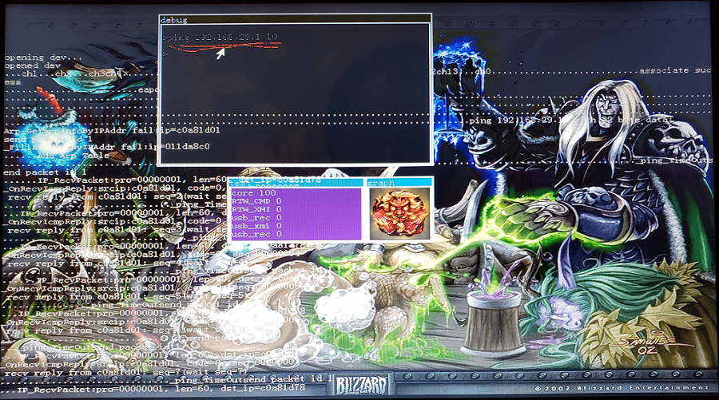

# os
operating system

## introduction
this is a personal operating system, it looks like this:

it supports:
1. multiple tasks, semaphore, message-based communication, memory management;
2. PCI bus, USB host controller (OHCI, EHCI);
3. USB mice (HID), USB flash disk (mass storage);
4. FAT32 file system;
5. BMP image file;
6. graphical user interface (GUI), SVGA;
7. WiFi dongle (tp-link WN725N);

## usage

#### step 1. setup BIOS
enter BIOS setup menu:
1. enable legacy boot and disable UEFI;
2. select USB driver as boot device;

this is an example: https://www.asus.com/support/FAQ/1013017

#### step 2. install OS on USB drive
run (**as administrator**) master/fs.exe. select "USB-HDD" and then "start".

!!! IT WILL CLEAN USB DRIVE

    if the USB flash disk CANNOT boot, run fs.exe again and select "USB-FDD".

#### step 3. boot PC from USB flash disk

#### step 4. some shell commands
help (list commands)

svesa (change the resolution)

desktop (use picture as background)

## rebuild OS (compile & link)
    **if you want to rebuild system after making changes in source code**

double click **project\os4\build\build - all.bat** if you updated code in project\os4

double click project\32\build.bat if you updated code in project\32

double click project\16\build.bat if you updated code in project\16
